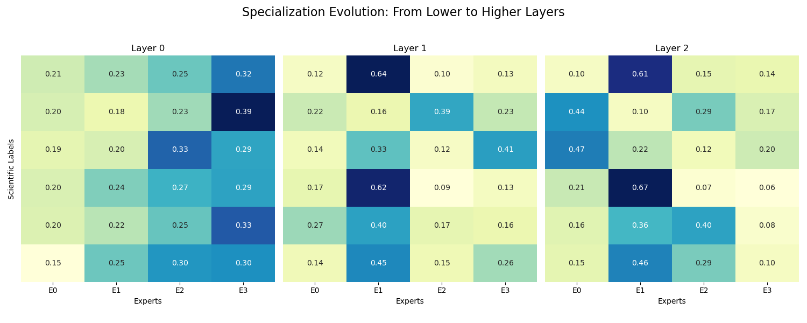
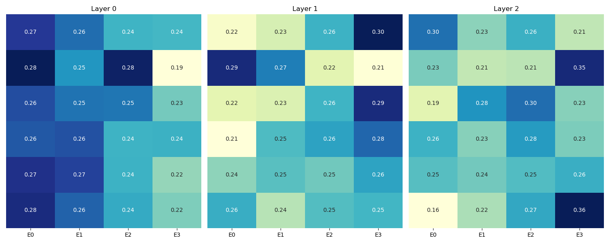

Для обучения трансформера добавлены MOE слои. При выборе эксперта выбирался один наилучший.
После обучения получилось такое распределпение. Видно, что на первом слое эксперт E3 имеет больше самые большие значения.
Однако на последнем слое он не имеет лидерства.

Была сделана попытка сделать распределение на первом слое более равномерным с помощью load-balancing на основе кол-ва отправленных токенов. Его распределение ниже:

Распределение стало более равномерным, но F1 score у обоих моделеий примерно одинаковый = 0.77.

В итоге на обоих heatmap есть классы, для которых есть 2 эксперта с достаточно большим и схожим влиянием. Возможно, в случаях, когда экпертов меньше, чем классов, правильнее смотреть на ответ нескольких (увеличить значение top_k из конфига).